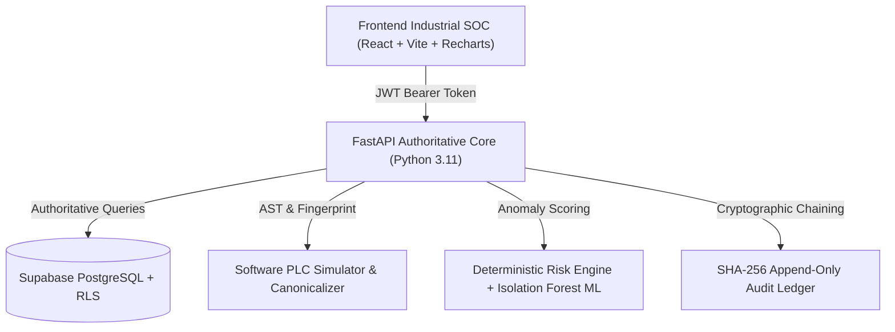

# MaintX — Industrial Zero-Trust Cybersecurity & PLC Integrity Platform

[](https://fastapi.tiangolo.com)
[](https://react.dev)
[](https://www.typescriptlang.org)
[](https://tailwindcss.com)
[](https://supabase.com)
[](https://pytest.org)
[](https://www.isa.org)

**MaintX** is an industrial cybersecurity platform engineered for Operational Technology (OT), Industrial Control Systems (ICS), and SCADA environments. It enforces **Zero-Trust Maintenance Accountability**, **PLC Logic Integrity Verification**, and **Tamper-Evident Cryptographic Audit Logging**.

---

## 🔗 Quick Access Links

| Service | URL | Description |
|---|---|---|
| **SOC Dashboard (Frontend)** | [http://127.0.0.1:5173/](http://127.0.0.1:5173/) | Industrial SOC interface (Login, Registry, PLC Monitor, Logbook) |
| **Backend API Swagger Docs** | [http://127.0.0.1:8000/docs](http://127.0.0.1:8000/docs) | Interactive OpenAPI / Swagger UI for all REST endpoints |
| **API Health Check** | [http://127.0.0.1:8000/health](http://127.0.0.1:8000/health) | Real-time service & database connectivity health probe |
| **GitHub Repository** | [https://github.com/deepak7-shadow/MaintX](https://github.com/deepak7-shadow/MaintX) | Source code, migrations, and CI workflows |

---

## ⚡ Key Capabilities

### 1. Zero-Trust Maintenance Closure Gatekeeper
- Maintenance sessions **cannot be closed** if unauthorized, unexpected, or unresolved critical changes exist.
- The authoritative backend enforces closure gating (`HTTP 409 Conflict`) independently of the frontend.

### 2. Software PLC Canonicalization & Semantic AST Diffing
- Converts structured ladder logic/AST to canonical JSON format (sorted keys, normalized types).
- Generates reproducible **SHA-256 bytecode fingerprints**.
- Detects added/removed/modified rungs, timer presets, and setpoints.
- Special tracking for **N7 Safety Interlocks** (`SAFETY_OK → MACHINE_ENABLE`). Unauthorized removal flags a `CRITICAL` safety violation.

### 3. Change Detection & Hybrid Risk Engine
- Tracks 6 critical operational categories: `PARAMETERS`, `PLC_LOGIC`, `NETWORK`, `FIREWALL`, `FIRMWARE`, `SAFETY_CONFIG`.
- **Deterministic Rules Engine**: High-risk penalties for unexpected IP changes ($\ge 75$) or safety modifications ($\ge 95$).
- **Isolation Forest ML Anomaly Detector**: Scikit-Learn unsupervised outlier detection on maintenance feature vectors.

### 4. Cryptographic Append-Only Security Logbook
- Every event is linked via SHA-256 hash chaining:
  $$H_i = \text{SHA256}(H_{i-1} \parallel \text{canonical}(E_i))$$
- Built-in verification endpoint `POST /api/logs/verify-integrity` validates the entire hash chain from Genesis ($0^{64}$) to Head.
- Includes a safe, simulated tamper test endpoint (`POST /api/logs/demo-tamper`) to demonstrate tamper detection.

### 5. Industrial Cybersecurity SOC Dashboard
- High-contrast tactical OT design (Tailwind CSS, Lucide Icons, Recharts).
- **12 Dedicated Pages**: Login, Dashboard, Machines, Machine Details, Maintenance, Maintenance Details, PLC Integrity, Change Investigation, Logbook, Analytics, Reports, Notifications.
- **9 Core KPI Cards**: Total Machines, Active Maintenance, Changes Today, High Risk Changes, Critical Changes, Unresolved Changes, PLC Integrity Violations, Verified Machines, Audit Log Integrity.

---

## 🏛️ System Architecture



---

## 📂 Project Structure

```
MaintX/
├── backend/
│   ├── app/
│   │   ├── api/             # REST Routers (auth, machines, maintenance, plc, risk, audit, verification)
│   │   ├── core/            # Config, security, JWT decoding
│   │   ├── db/              # Supabase / PostgreSQL client
│   │   ├── schemas/         # Pydantic validation models
│   │   └── services/        # Business logic, engines, & simulators
│   │       ├── anomaly_detector.py      # Isolation Forest ML
│   │       ├── audit_chain.py           # SHA-256 hash chaining
│   │       ├── change_engine.py         # Change detection & policies
│   │       ├── plc_engine.py            # AST diffing & canonicalization
│   │       ├── risk_engine.py           # Deterministic risk scoring
│   │       └── verification_engine.py   # Multi-dimensional closure gate
│   └── tests/               # 118 unit & integration tests
├── frontend/
│   ├── src/
│   │   ├── components/      # UI primitives, Sidebar, TopBar, Logbook
│   │   ├── lib/             # Shared TypeScript types & mock data
│   │   ├── pages/           # 12 SOC Dashboard pages
│   │   └── App.tsx          # Master router with auth state
├── supabase/
│   └── migrations/          # 5 SQL migrations (19 tables, RLS policies, seed data)
└── docs/                    # Architecture diagrams & specifications
```

---

## 🚀 Running Locally

### 1. Backend (FastAPI)
```bash
cd backend

# Create & activate virtual environment
python -m venv .venv
# Windows:
.venv\Scripts\activate
# Linux/macOS:
source .venv/bin/activate

# Install dependencies
pip install -r requirements.txt

# Run server
uvicorn app.main:app --host 127.0.0.1 --port 8000 --reload
```
*API will be live at `http://127.0.0.1:8000` with documentation at `http://127.0.0.1:8000/docs`.*

### 2. Frontend (React + Vite)
```bash
cd frontend

# Install dependencies
npm install

# Start development server
npm run dev
```
*Dashboard will be live at `http://127.0.0.1:5173`.*

---

## 🧪 Running Automated Tests

The test suite validates authentication, PLC canonicalization, change detection, deterministic scoring, ML anomaly detection, cryptographic hash chaining, and maintenance gatekeeping:

```bash
cd backend
pytest -v
```

**Results (118/118 passing):**
```
tests/test_health.py          2 passed
tests/test_auth.py           10 passed
tests/test_stage4.py         16 passed
tests/test_stage5.py         23 passed
tests/test_stage6.py         15 passed
tests/test_stage7.py         12 passed
tests/test_stage8.py         20 passed
tests/test_stage9.py         20 passed
==========================================
Total:                      118 passed
==========================================
```

---

## 🛡️ Role-Based Access Control (RBAC)

| Role | Permissions |
|---|---|
| **ADMIN** | Full system administration, policy overrides, audit ledger verification |
| **SUPERVISOR** | Work order approvals, session authorization, verification sign-offs |
| **MAINTENANCE_ENGINEER** | Execute assigned maintenance sessions, deploy approved PLC programs |
| **SECURITY_ANALYST** | Read-only change investigation, anomaly review, threat mitigation |
| **AUDITOR** | Read-only compliance inspection, cryptographic hash ledger audit |

*All roles are validated server-side against database profiles. Frontend role claims are never trusted.*

---

## 📜 Compliance Standards

- **IEC 62443-3-3**: Security for Industrial Automation and Control Systems (System Security Requirements & Security Levels).
- **NIST SP 800-82 Rev. 3**: Guide to Operational Technology (OT) Security.
- **ISO/IEC 27001:2022**: Operational security & tamper-evident logging (Annex A.12).